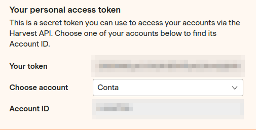

# harvest-flex-calculator

## How to build:
1. Go to harvest and create a personal token. It looks like this:



2. Add a `.env` file with the following details:

```dotenv
export HARVEST_HOURS_PER_DAY=7.5 # How many hours are in a standard work day.
export HARVEST_BEARER_AUTH="Bearer " # Your token. You need to add "Bearer" in front of your token.
export HARVEST_ACCOUNT_AUTH=   # Account ID.
```

3. Source the `.env` file: `source .env`
4. Build the application: `cargo build`

## How to use:
The calculator is used as follows:

`cargo run [OPTIONAL start date] [OPTIONAL end date]`

By default, the calculator will calculate the flex time from the start of the current year to today. You can also provide
a start date and/or an end date if you want to limit the period. The start and end date cannot be in the future. The start
date can not be after the end date.

### Examples
- `cargo run`: Calculate the flex from the start of the current year to the current date.
- `cargo run 2021-08-01`: Calculates the flex from 2021-08-01 to the current date
- `cargo run 2021-01-01 2023-01-01`: Calculate the flex from 2021-01-01 to 2023-01-01.

